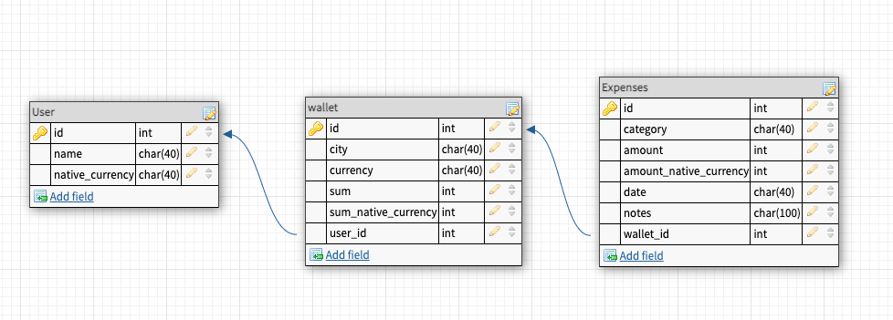
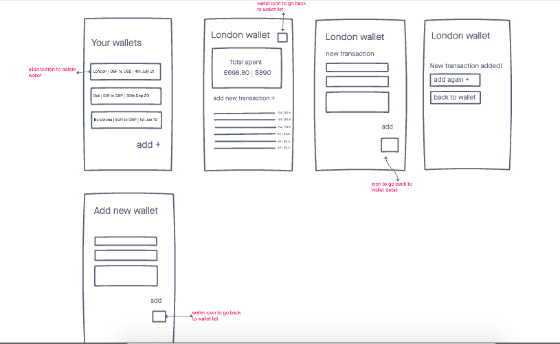
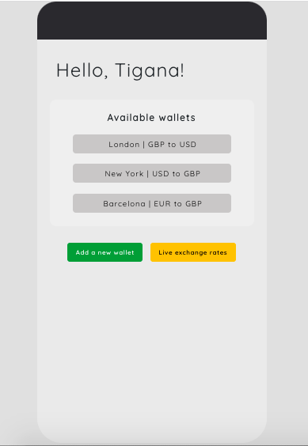
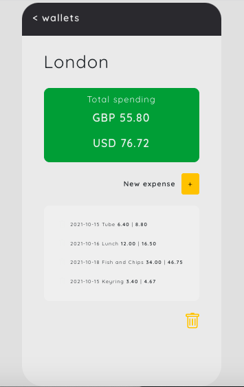

# Travel Expense Tracker - Travellet

## What is it?

Travellet (name TBC) is a travel expense tracker that helps users track their spending whilst travelling abroad and manage its different currency spending.

Inspired by traveling in Indonesia, which is a mostly cash-based country, difficult to track spending through bank accounts transactions alone.

## How is it built?

The app is mobile first application, built in React with Mysql database and using third party exchange rates API (Alpha Vantage API).

Currently a single user application (Tigana) but in the future the database has been set up for login and authentications for different users and the Live exchange rates will be tailored according to the user's native currency.

## Installation Guide

**Database migration**

1. Create a dabatase called 'expenses' on mysql - command: CREATE DATABASE expense;
2. Create .env file and fill in all details:
   DB_HOST = localhost
   DB_USER = root
   DB_PASS = **enter your own password**
   DB_NAME = expenses
3. Create your .gitignore file and include your .env and node_modules/ files
4. Go to my express app. On the terminal: $ cd my-express-app/
5. $ yarn
6. $ yarn migrate

**Front end**

1. On the project terminal $ cd client
2. $ yarn (to install dependencies)
3. Once installed $ yarn start

## Application Elements

1. Wallet
2. List of Expenses/transactions and it's currency conversion
3. Total Sum of transactions in a specific wallet
4. Live exchange rates

## Third Party API

The app is using Alpha Vantage API for its live currency rates. Many live currency rates API only have very limited calls per hour therefore Alpha Vantage is chosen as it allows for 5 Api calls per minute and 500 per hour. More improvements on this can be found below on **future improvements** section.

## Database Schema

Created using DB Designer - please note that the following modification was made:

- User table were created but not yet used (will be used in the next phase)
- Native currency in the user table is now being stored in wallet table

## Initial User flow diagram

Created using Invision App.

## User Interface

Wallet List:

Wallet Detail:

## Challenges

- Initially the app wasn't using React Router and attempted on using Conditional Rendering, however, once React Router was installed, moving around different views and pages were proven to be much easier with much cleaner codes.

- Initially, external API on the live exchange rates were called in App.js but this proves to be an issue as there is a lag between when the wallet is click (and thus establishing the currencies to be converted) and when the API is called. The solution is to move the external API call in a component where the currency is displayed (WalletDetail.js). There is still .50 second delay to convert the amount as the app refreshes but this does not prove to impact negatively on user experience.

- The app's developer was not able to pull the transactions SUM as an overview in the wallet list. Therefore this feature had to be let go, however, could be looked into in the **future improvement**.

- 5 API calls limitation per minute was also an issue. Not in the transactions list itself (as it is being called using one API call), but when calling the live currency exchange, as the app calls 4x API calls at any given refresh. At this point this feature is a nice to have feature therefore this can definitely be improved.

## Future improvements?

So many! Due to time constraints many app's initial intended features were not able to be implemented.

1. Delete button - to delete wallet and transactions
2. Update/modify transactions or wallet
3. Sum of wallet in the wallet list as a quick reminder for user.
4. Live currency rates with the ability to pick favourite rates (Drop down menu)
5. Categories breakdown. Each transactions have a category assigned to it. A graph / chart should be implemented to enable user to view summary of category in their spending
6. Map API to locate the nearest currency exchange places
7. Web and mobile responsiveness
